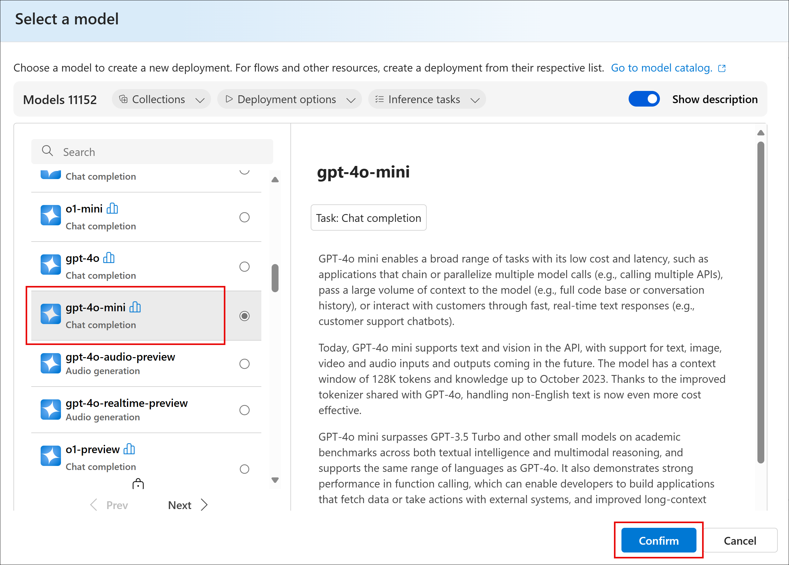

# Start Smart: Build Your First AI Using Azure AI Foundry

- [Start Smart: Build Your First AI Using Azure AI Foundry](#start-smart-build-your-first-ai-using-azure-ai-foundry)
  - [Exercise 1: Build Your First Agent in Azure AI Foundry](#exercise-1-build-your-first-agent-in-azure-ai-foundry)
    - [Task 1: Deploy an AI Hub](#task-1-deploy-an-ai-hub)
    - [Task 2: Create an Agent](#task-2-create-an-agent)
  - [Exercise 2: Powerful Agentic Workflows Using Power Automate](#exercise-2-powerful-agentic-workflows-using-power-automate)
    - [Task 1: Create an Instant Cloud Flow](#task-1-create-an-instant-cloud-flow)


In this lab, you will learn how to build your first AI agent using Azure AI Foundry and integrate it with Power Automate for workflow automation. The lab is divided into two main exercises:

1. **Exercise 1:** Guides you through deploying an AI Hub in Azure, creating a project, deploying an agent using the GPT-4o-mini model, and enriching it with knowledge from a PDF document. You will also test your agent's capabilities in the playground.

2. **Exercise 2:** Demonstrates how to create an automated workflow using Power Automate. You will set up an instant cloud flow that sends user queries to your Azure AI agent and delivers the AI-generated responses via email.

By completing this lab, you will gain hands-on experience in deploying AI solutions on Azure and automating interactions using Microsoft Power Platform.

## Exercise 1: Build Your First Agent in Azure AI Foundry

### Task 1: Deploy an AI Hub

1. Go to [https://portal.azure.com/](https://portal.azure.com/).

2. In the top search bar, type "AI Foundry" and select **Azure AI Foundry**.

    

3. In the left navigation, expand the **Use with AI Foundry** left menu item, select **AI Hubs**, select **Create**, then **Hub**.

    

4. Create a new Resource Group:
   - Use the format `<yourname>-rg`

   

5. Add the Hub name:
   - Use the format `<yourname>-hub`
   - You can add a friendly name
   - Do not change any default values

   

8. Select **Next: Storage** — leave all values as-is  
9. Select **Next: Inbound Access** — leave all values as-is  
10. Select **Next: Outbound Access** — leave all values as-is  
11. Select **Next: Encryption** — leave all values as-is  
12. Select **Next: Identity** — leave all values as-is  
13. Select **Next: Tags** — skip creating tags  
14. Select **Next: Review + Create**  
15. Select **Create**

    

    

16. Wait for deployment confirmation: "Your deployment is complete".

17. Select **Go to resource**.

    

18. Select **Launch Azure AI Foundry**.

    

### Task 2: Create an Agent

1. In your AI Hub space, select **New Project**.

    

2. In the popup:
   - Name your project `<yourname>-project`.
   - Select **Create**.

   

3. You will see your project dashboard.

    

4. Select **Agents** in the left navigation.

5. Select the Azure OpenAI resource:
   - Select **Let’s go**.

   

6. Pick a model for your agent:
   - Choose `gpt-4o-mini`.
   - Select **Confirm**.

   

7. Deploy the model:
   - Select **Deploy**.

   

8. You'll be navigated to the **My agents** screen.

    

9. Select your agent, then:
   - In the right navigation, go to **Knowledge**.
   - Select **Add**.

   

10. Select **Files** to upload the [cloth mask vs medical mask.pdf](cloth-mask-vs-medical-mask.pdf?raw=true) PDF.
    - Select **Upload and save**.
    - The file is now added to the vector store.

    

11. Test your model:
    - Select **Try in Playground**.
    - Enter a query in the input box.

    

> Examples:
> 
> - What documents do I have available?
> - Breakdown the differences in efficacy between cloth and medical masks, based on the provided data.
> - Can you create a diagram that shows these differences?


## Exercise 2: Powerful Agentic Workflows Using Power Automate

> ⚠️ *Note: Only proceed after successfully creating your Agent in Azure AI Foundry.*

### Task 1: Create an Instant Cloud Flow

1. Go to your Microsoft365 Account:  
   [https://m365.cloud.microsoft/](https://m365.cloud.microsoft/)

2. Select on **Power Automate** under **Apps**

3. Select **Create** → **Instant Cloud Flow**

4. Use a **Manual Trigger** and select **Create**

5. Select on **Manually Trigger a Flow**  
6. Select **Add an Input** → select **Text**  
7. Enter the input name: `UserQuery`  
8. Select outside to save it

9. Select the `+` button below and add a new **HTTP** action

10. Configure the HTTP action:
    - **URL**: Copy from Azure Foundry → Models and Endpoints → gpt-4o → URL  
    - **Method**: `POST`  
    - **Headers**:
      - `Content-Type`: `application/json`
      - `api-key`: *(your Azure OpenAI key)*

    - **Body**:

    ```json
    {
      "messages": [
        {
          "role": "system",
          "content": "You are a helpful assistant that helps users find answers in PDF documents and provide concise, accurate answers."
        },
        {
          "role": "user",
          "content": "Input"
        }
      ],
      "temperature": 0.7,
      "max_tokens": 300
    }
    ```

11. Add a new **Parse JSON** node:
    - **Content**: Select `Body` from HTTP response
    - **Schema**:
    
    ```json
    {
      "id": "chatcmpl-12345",
      "choices": [
        {
          "message": {
            "role": "assistant",
            "content": "Here is the AI response."
          }
        }
      ]
    }
    ```

12. Add a final node: **Send an Email (V2)**

13. Configure the email:
    - **To**: your email address
    - **Subject**: your subject
    - **Body**:

    ```text
    outputs('Parse_JSON')?['body']?['choices'][0]['message']['content']
    ```

14. Select **Save**

15. Select **Test** → **Test Flow Manually**

16. Grant permission to Outlook when prompted

17. Enter your query related to the PDF uploaded to your Azure AI Foundry agent

18. You should receive an email with the agent’s response  
    - If not, go to **Flow Runs** to troubleshoot
